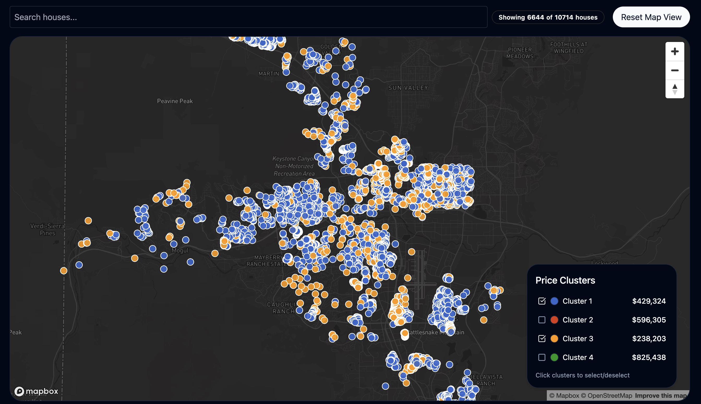
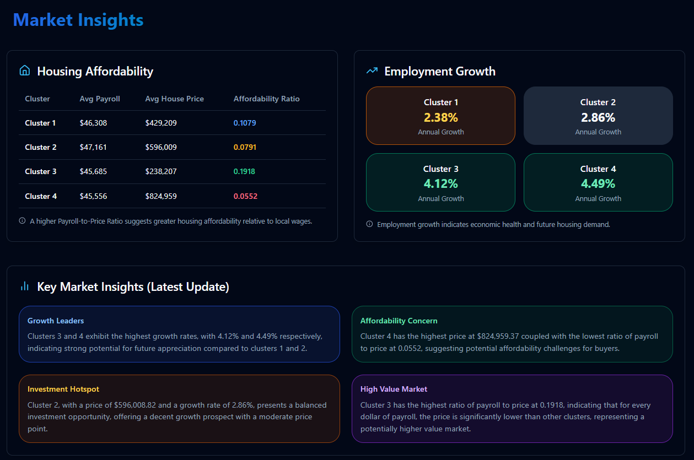
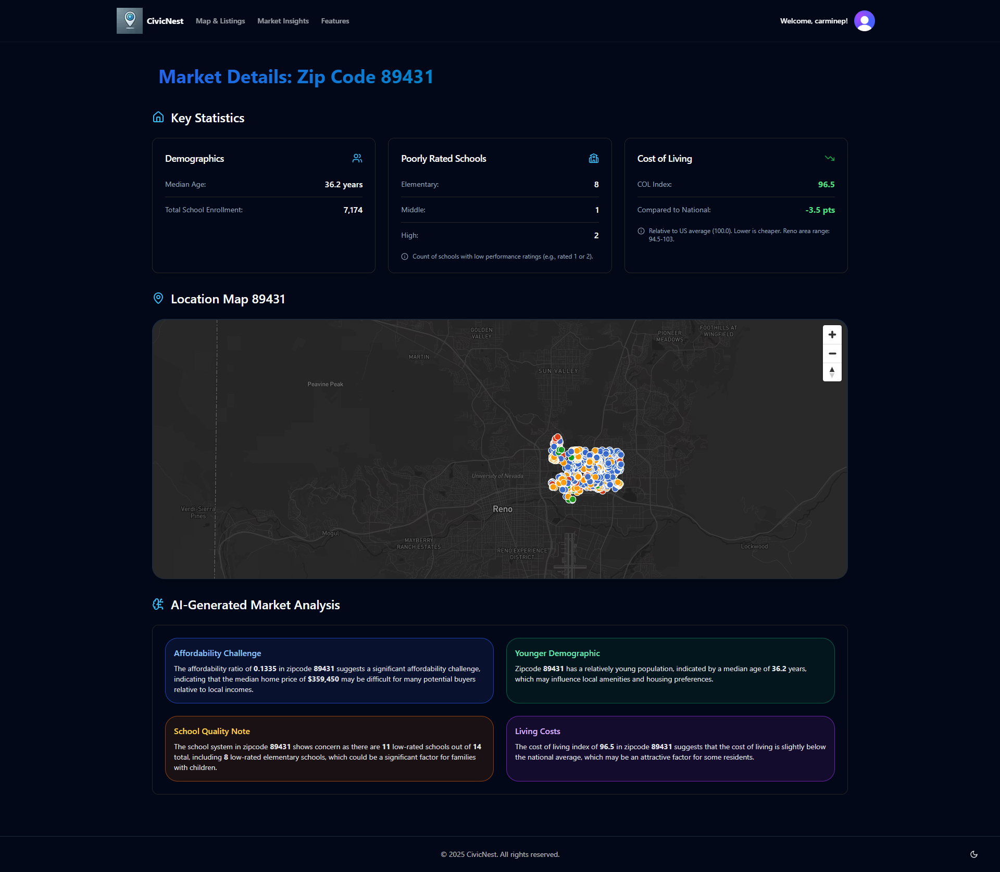

# CivicNest

  
  
<i>Revolutionizing property search with comprehensive neighborhood analytics</i>

## About CivicNest

CivicNest is an innovative web application designed to revolutionize property investment decisions by providing comprehensive insights beyond traditional real estate listings. While conventional platforms focus on basic property details, CivicNest delivers detailed neighborhood analytics and economic indicators that directly impact investment potential and long-term value appreciation, initially focused on the Reno, Nevada area.

Our interactive map interface uses color-coded markers to visualize properties grouped into **price clusters**, offering an immediate understanding of market segmentation. We go further by incorporating vital economic data and powerful filtering tools, such as:

-   💰 **Price Cluster Analysis**: Understand property values in the context of surrounding comparable homes.
-   📈 **Employment Trend Predictions**: Gauge potential neighborhood economic health via projected employment changes by zipcode.
-   🏠 **Detailed Property Insights**: Access specific details including price, bed/bath counts, cluster averages, and direct links to Zillow listings.
-   📍 **Zip Code Deep Dives**: Analyze specific zip codes with data on demographics, school ratings, cost of living, and localized mapping. (Requires Account)
-   🧠 **AI-Generated Market Summaries**: On our dedicated Insights Page and within Zip Code details, **key market insights are automatically generated by AI** using the underlying property and economic data, providing deeper context. (Requires Account)

## Live Demo

Access the live application here: **[https://civicnest-03dbc0b45eef.herokuapp.com/](https://civicnest-03dbc0b45eef.herokuapp.com/)**

## Key Features

-   **Interactive Price Cluster Map**: Color-coded visualization grouping properties by price range. Click markers for quick property details including price, bed/bath, cluster average, and employment trend %.
-   **Direct Zillow Link**: Seamlessly navigate from a property popup on our map to its full listing on Zillow.
-   **Cluster Filtering**: Easily isolate and view properties belonging only to specific selected price clusters, allowing focused analysis of market segments.
-   **Employment Trend Data**: Displays predicted annual employment percentage change for a property's zipcode, offering insight into local economic direction.
-   **Detailed Zip Code Insights**: Access comprehensive data for specific zip codes, including demographics (median age, school enrollment), poorly-rated school counts, Cost of Living index analysis, a dedicated map view, and AI-generated takeaways. (Requires Account)
-   **AI-Generated Insights Page**: Presents **key market summaries derived by AI** from the available property and economic data for selected clusters and zip codes, offering a concise overview of trends and characteristics. (Requires Account)
-   **Property Address Search**: Quickly find and select specific properties on the map using an address search dropdown.
-   **Mobile Responsive Design**: Seamless experience across all devices.
-   **Secure Authentication**: Protected user accounts with social sign-on options via Clerk.

## Screenshots

  
  
<i>Interactive neighborhood mapping with price clusters and property insights (including Zillow link).</i>

    
  
  
<i>Insights Page Showcasing AI-generated key market summaries for selected property clusters.</i>

    
  
  
<i>Zip Code Insights Page providing detailed demographics, school data, COL index, and AI analysis.</i>

   

## Technology Stack

-   **Frontend:** Next.js, React, Tailwind CSS, shadcn/ui, Lucide Icons
-   **Mapping:** MapBox GL JS API
-   **Authentication:** Clerk
-   **Data Sources:** Multiple public APIs (including housing data, cluster analysis), ethical web scraping techniques, employment trend prediction data, zip code level demographic/economic/school data.
-   **AI/ML:** Utilized for generating market insights based on aggregated data.
-   **Deployment:** Heroku
-   **Version Control:** GitHub

## Meet the Team

| Team Member        | Role                  | GitHub                                                   |
| :----------------- | :-------------------- | :------------------------------------------------------- |
| Carmine Potirniche | Full-Stack Developer  | [GitHub Profile](https://github.com/Potirniche-Carmine)  |
| Timmy Norris       | API and Data Engineer | [GitHub Profile](https://github.com/1109-Norris-Timmy)   |
| Kaleo Sanchez      | DevOps Developer      | [GitHub Profile](https://github.com/KaleoSanchez)        |
| Brandon Foy        | Backend Developer     | [GitHub Profile](https://github.com/brandon-j-foy)       |

## Our Mission

In today's competitive housing market, CivicNest stands out by offering unprecedented transparency and deeper property insights, including localized economic indicators, **zip code analytics, and AI-powered market summaries**. By visualizing price clusters, presenting employment trends, enabling powerful filtering, and streamlining the house-hunting process, we aim to reduce the stress of home buying while enabling users to make more confident and data-driven property investment decisions.