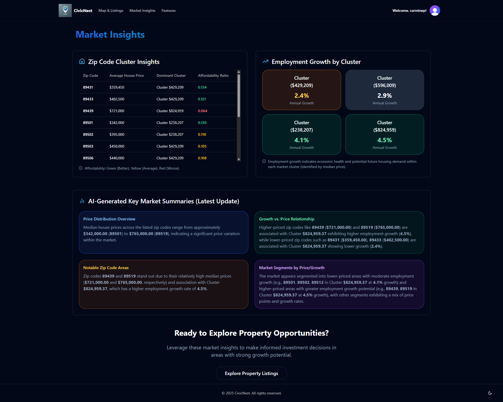

# CivicNest

  
  
<i>Revolutionizing property search with comprehensive neighborhood analytics</i>

## About CivicNest

CivicNest is an innovative web application designed to revolutionize property investment decisions by providing comprehensive insights beyond traditional real estate listings. While conventional platforms focus on basic property details, CivicNest delivers detailed neighborhood analytics and economic indicators that directly impact investment potential and long-term value appreciation.

Our interactive map interface uses color-coded markers to visualize properties grouped into **price clusters**, offering an immediate understanding of market segmentation. We go further by incorporating vital economic data, such as:

-   💰 **Price Cluster Analysis**: Understand property values in the context of surrounding comparable homes.
-   📈 **Employment Trend Predictions**: Gauge potential neighborhood economic health via projected employment changes by zipcode.
-   🏠 **Detailed Property Insights**: Access specific details including price, bed/bath counts, cluster averages, and direct links to Zillow listings.
-   🧠 **AI-Generated Market Summaries**: On our dedicated Insights Page, **key market insights for selected clusters are automatically generated by AI** using the underlying property and economic data, providing deeper context.

## Live Demo

Access the live application here: **[https://civicnest-03dbc0b45eef.herokuapp.com/](https://civicnest-03dbc0b45eef.herokuapp.com/)**

## Key Features

-   **Interactive Price Cluster Map** - Color-coded visualization grouping properties by price range, highlighting market segments.
-   **Employment Trend Data** - Displays predicted employment percentage change for a property's zipcode, offering insight into local economic direction.
-   **Detailed Property Popups** - Quick access to essential data: price, address, bed/bath, cluster average price, employment trend, and a direct Zillow link.
-   **AI-Generated Insights Page** - Presents **key market summaries derived by AI** from the available property and economic data for selected clusters, offering a concise overview of trends and characteristics.
-   **Cluster Filtering** - Isolate and view properties belonging only to specific selected price clusters.
-   **Property Search & Selection** - Easily find specific properties by address via a dropdown search.
-   **Mobile Responsive Design** - Seamless experience across all devices.
-   **Secure Authentication** - Protected user accounts with social sign-on options.

## Screenshots

  
  
<i>Interactive neighborhood mapping with price clusters and insights</i>

  
  
<i>Insights Page Showcasing **AI-generated** key market insights for selected property clusters.</i>

  

## Technology Stack

-   **Frontend:** Next.js, React, Tailwind CSS, shadcn/ui, Lucide Icons
-   **Mapping:** MapBox GL JS API
-   **Authentication:** Clerk
-   **Data Sources:** Multiple public APIs (including housing data, cluster analysis), ethical web scraping techniques, employment trend prediction data.
-   **AI/ML:** Utilized for generating market insights based on aggregated data.
-   **Deployment:** Heroku
-   **Version Control:** GitHub

## Meet the Team

| Team Member        | Role                 | GitHub                                                   |
| :----------------- | :------------------- | :------------------------------------------------------- |
| Carmine Potirniche | Full-Stack Developer | [GitHub Profile](https://github.com/Potirniche-Carmine)  |
| Timmy Norris       | API and Data Engineer| [GitHub Profile](https://github.com/1109-Norris-Timmy)   |
| Kaleo Sanchez      | DevOps Developer     | [GitHub Profile](https://github.com/KaleoSanchez)      |
| Brandon Foy        | Backend Developer    | [GitHub Profile](https://github.com/brandon-j-foy)       |

## Our Mission

In today's competitive housing market, CivicNest stands out by offering unprecedented transparency and deeper property insights, including localized economic indicators **and AI-powered market summaries**. By visualizing price clusters, presenting employment trends, and streamlining the house-hunting process, we aim to reduce the stress of home buying while enabling users to make more confident and data-driven property investment decisions.